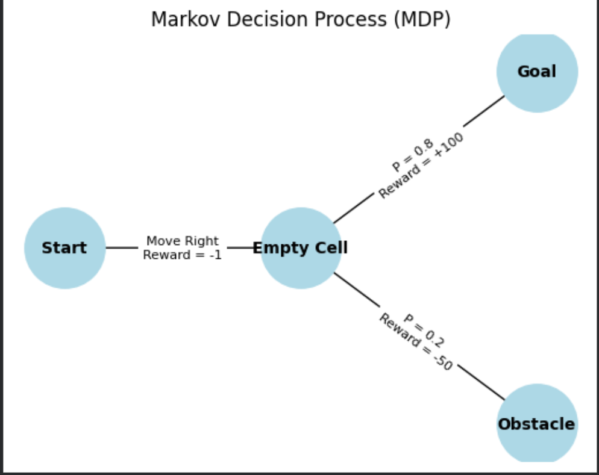
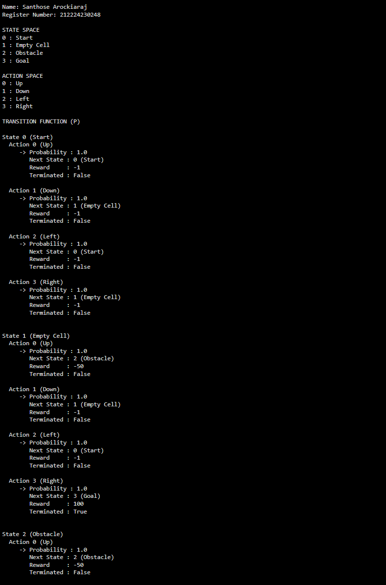

# Representation-of-a-Real-World-Problem-as-a-Markov-Decision-Process


## Aim

To identify a real-world autonomous robot navigation decision-making problem of  and represent it formally as a Markov Decision Process by defining its states, actions, rewards, transitions, and Python representation.

---

## Problem Statement

### Problem Description

Consider an autonomous delivery robot operating in a warehouse. The robot must navigate from the starting location to the delivery destination while avoiding obstacles and minimizing travel time. At each step, the robot decides which direction to move. Due to uncertainty, the robot may occasionally slip or encounter obstacles. The objective is to maximize the total reward by reaching the destination safely.

---

## MDP Components

A Markov Decision Process is represented as:

$$
MDP = (S, A, P, R, \gamma)
$$

Where:

| Symbol | Meaning |
|---|---|
| $S$ | Set of states |
| $A$ | Set of actions |
| $P$ | Transition probability function |
| $R$ | Reward function |
| $\gamma$ | Discount factor |

---

## State Space

The possible state for autonoumous robot are

Example format:

```text
S = {
    Start,
    Empty cell,
    Obstacle,
    Goal
}
```


---

## Sample State

Cuurent state = Empty cell


---

## Action Space

Write your answer here.

The all possible actions that are available to the agent(autonomous robot).

Example format:

```text
A = {
    Move Right,
    Move Left,
    Move Up,
    Move Down
}
```


---

## Sample Action

Current Action = Move Right

---

## Transition Probability


The transition probability explains how the environment moves from one state to another after an action is taken.

General form:

$$
P(s' \mid s,a)
$$

Example:

0.8 → Robot successfully moves in the intended direction.
0.1 → Robot slips to the left.
0.1 → Robot slips to the right.


---

## Reward Function


The reward function defines the feedback received by the agent after taking an action.

General form:

$$
R(s,a,s')
$$

Example:
+100 - Reaching the goal
-50  - Hit an obstacle
-1   - Moved to the empty cell


---

## Graphical Representation




---

## Python Representation

Write your code here.

Use Python dictionaries to represent the MDP.


```python
# ---------------------------------------------
# Representation of a Real-World Problem as MDP
# Warehouse Robot Navigation
# ---------------------------------------------

print("Name: Santhose Arockiaraj")
print("Register Number: 212224230248")

# State Mapping
states = {
    0: "Start",
    1: "Empty Cell",
    2: "Obstacle",
    3: "Goal"
}

# Action Mapping
actions = {
    0: "Up",
    1: "Down",
    2: "Left",
    3: "Right"
}

# Discount Factor
gamma = 0.9

# MDP Transition Dictionary
# Format:
# P[state][action] = [(probability, next_state, reward, terminated)]

P = {

    # ---------------- State 0 : Start ----------------
    0: {
        0: [(1.0, 0, -1, False)],   # Up
        1: [(1.0, 1, -1, False)],   # Down
        2: [(1.0, 0, -1, False)],   # Left
        3: [(1.0, 1, -1, False)]    # Right
    },

    # ---------------- State 1 : Empty Cell ----------------
    1: {
        0: [(1.0, 2, -50, False)],  # Up
        1: [(1.0, 1, -1, False)],   # Down
        2: [(1.0, 0, -1, False)],   # Left
        3: [(1.0, 3, 100, True)]    # Right
    },

    # ---------------- State 2 : Obstacle ----------------
    2: {
        0: [(1.0, 2, -50, False)],  # Up
        1: [(1.0, 1, -1, False)],   # Down
        2: [(1.0, 2, -50, False)],  # Left
        3: [(1.0, 2, -50, False)]   # Right
    },

    # ---------------- State 3 : Goal (Terminal) ----------------
    3: {
        0: [(1.0, 3, 0, True)],     # Up
        1: [(1.0, 3, 0, True)],     # Down
        2: [(1.0, 3, 0, True)],     # Left
        3: [(1.0, 3, 0, True)]      # Right
    }
}

# ---------------------------------------------
# Display State Space
# ---------------------------------------------
print("\nSTATE SPACE")
for s in states:
    print(f"{s} : {states[s]}")

# ---------------------------------------------
# Display Action Space
# ---------------------------------------------
print("\nACTION SPACE")
for a in actions:
    print(f"{a} : {actions[a]}")

# ---------------------------------------------
# Display Transition Function
# ---------------------------------------------
print("\nTRANSITION FUNCTION (P)")

for state in P:
    print(f"\nState {state} ({states[state]})")

    for action in P[state]:

        print(f"  Action {action} ({actions[action]})")

        for probability, next_state, reward, terminated in P[state][action]:

            print(
                f"     -> Probability : {probability}"
                f"\n        Next State : {next_state} ({states[next_state]})"
                f"\n        Reward     : {reward}"
                f"\n        Terminated : {terminated}\n"
            )

# ---------------------------------------------
# Discount Factor
# ---------------------------------------------
print("Discount Factor (γ):", gamma)

```
---
## Output



---

## Result

The real-world warehouse robot navigation problem was successfully represented as a Markov Decision Process by defining the state space, action space, transition probabilities, reward function, and implementing the MDP using Python. This representation can be used as the foundation for reinforcement learning algorithms such as Value Iteration, Policy Iteration, and Q-Learning.


---

